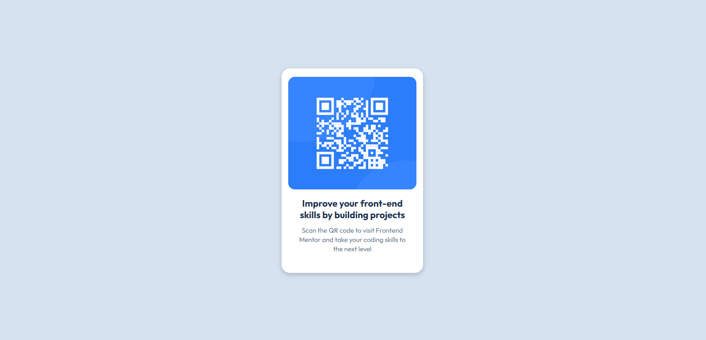

# Frontend Mentor - QR code component solution

This is a solution to the [QR code component challenge on Frontend Mentor](https://www.frontendmentor.io/challenges/qr-code-component-iux_sIO_H). Frontend Mentor challenges help you improve your coding skills by building realistic projects.

## Overview

### The challenge

Create a responsive QR code component that matches the provided design specifications for both mobile (375px) and desktop (1440px) viewports.

### Screenshot

### Links

- Solution URL: [GitHub Repo](https://github.com/jerrychan16/qr-code-component)
- Live Site URL: [Live Page](https://jerrychan16.github.io/qr-code-component/)

## My process

### Built with

- Semantic HTML5 markup
- CSS custom properties
- Flexbox for layout and centering
- Mobile-first responsive design
- Google Fonts (Outfit)

### What I learned

This project helped me understand:
- **Flexbox centering**: Using `display: flex`, `justify-content: center`, and `align-items: center` for perfect centering
- **Responsive design**: Creating layouts that work across different screen sizes using media queries
- **Component-based thinking**: Building self-contained UI components with proper spacing and typography

### Continued development

Areas I want to focus on in future projects:
- Image sizing strategies
- Advanced CSS Grid layouts
- CSS custom properties for better maintainability

### Useful resources

- CSS Flexbox Guide- Helped me understand flexbox centering

## Author

- Frontend Mentor - [@jerrychan16](https://www.frontendmentor.io/profile/jerrychan16)
- GitHub - [@jerrychan16](https://github.com/jerrychan16)

## Acknowledgments

Thanks to Frontend Mentor for providing this challenge.